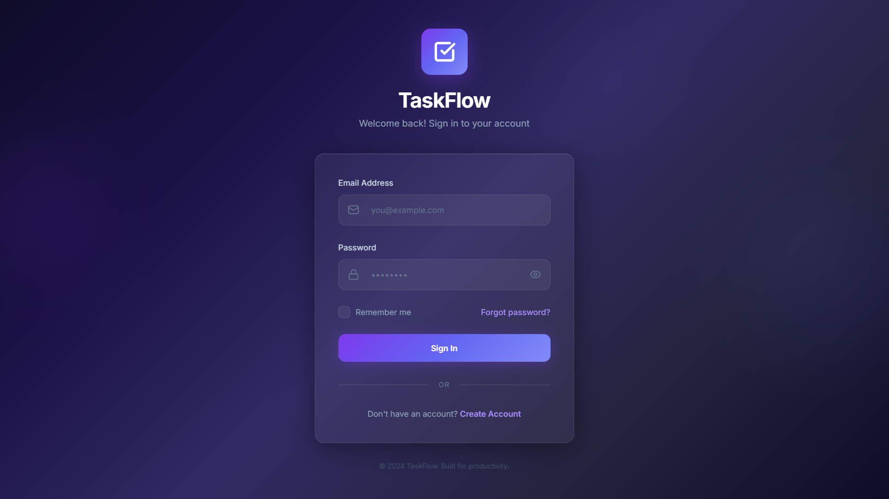
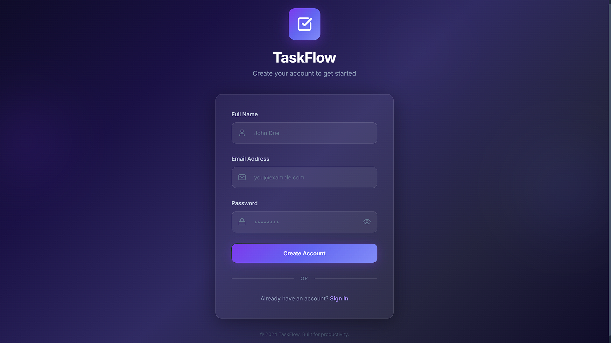
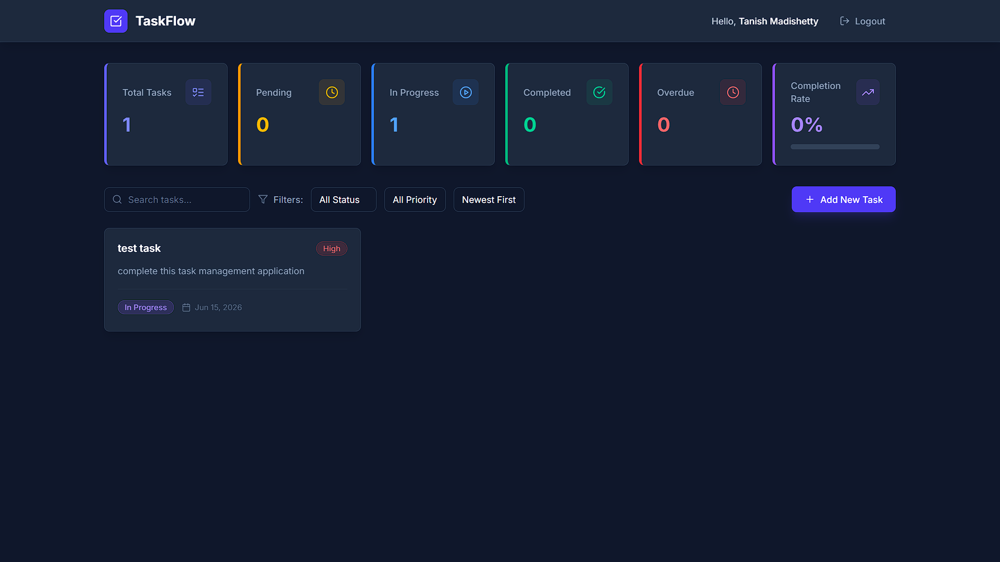

# TaskFlow - Task Management Application

## Live Demo

**Frontend:**
```text
https://taskflow-task-manager-psi.vercel.app
```

**Backend API:**
```text
https://taskflow-task-manager-h3zv.onrender.com
```

---

## Project Overview

TaskFlow is a full-stack task management web application that enables users to create, manage, update, and track their daily tasks efficiently.

The application provides secure user authentication, task organization, status tracking, and a modern responsive user interface. It is designed to demonstrate full-stack web development concepts including frontend development, backend APIs, database integration, authentication, and cloud deployment.

---

## Project Highlights

- Full-stack MERN application
- Secure JWT-based authentication
- MongoDB Atlas cloud database integration
- RESTful API architecture
- Responsive user interface
- Deployed using Vercel and Render
- Complete CRUD functionality for task management

## Features

### User Authentication
- User Registration
- User Login
- Password Encryption using bcrypt
- JWT Authentication
- Protected Routes
- Secure User Sessions

### Task Management
- Create New Tasks
- View All Tasks
- Update Existing Tasks
- Delete Tasks
- Mark Tasks as Completed
- Track Task Status (Pending, In Progress, Completed, Overdue)

### User Experience
- Responsive Design
- Modern Dark UI
- Fast Performance
- Mobile Friendly Layout
- Real-Time Interface Updates
- Task Filtering by Status and Priority

### Database Integration
- MongoDB Atlas Cloud Database
- Secure Data Storage
- User-Specific Tasks

---

## Tech Stack

### Frontend
- React.js
- React Router
- Axios
- CSS3
- Vite

### Backend
- Node.js
- Express.js

### Database
- MongoDB Atlas
- Mongoose

### Authentication
- JSON Web Tokens (JWT)
- bcryptjs

### Deployment
- Vercel (Frontend)
- Render (Backend)
- MongoDB Atlas (Database)

---

## Project Architecture

```text
TaskFlow
│
├── Client (React Frontend)
│   ├── Authentication Pages
│   ├── Dashboard
│   ├── Task Components
│   └── API Services
│
├── Server (Express Backend)
│   ├── Authentication Routes
│   ├── Task Routes
│   ├── Middleware
│   └── Database Connection
│
└── MongoDB Atlas
    ├── Users Collection
    └── Tasks Collection
```

---

## Screenshots

### Login Page


### Register Page


### Dashboard


---

## Installation Guide

### Prerequisites
- Node.js
- npm
- MongoDB Atlas Account
- Git

### Clone Repository

```bash
git clone https://github.com/Tanish-8/taskflow-task-manager.git
cd taskflow-task-manager
```

### Install Backend Dependencies

```bash
cd server
npm install
```

### Install Frontend Dependencies

```bash
cd ../client
npm install
```

---

## Environment Variables

Create a `.env` file inside the `server` folder:

```env
PORT=5000
MONGO_URI=your_mongodb_connection_string
JWT_SECRET=your_jwt_secret_key
```

---

## Run Backend

```bash
cd server
npm start
```

Runs on: `http://localhost:5000`

---

## Run Frontend

```bash
cd client
npm run dev
```

Runs on: `http://localhost:5173`

---

## API Endpoints

### Authentication

| Method | Endpoint | Description |
|--------|----------|-------------|
| POST | `/api/auth/register` | Register a new user |
| POST | `/api/auth/login` | Login existing user |

### Tasks

| Method | Endpoint | Description |
|--------|----------|-------------|
| GET | `/api/tasks` | Get all tasks |
| POST | `/api/tasks` | Create a new task |
| PUT | `/api/tasks/:id` | Update a task |
| DELETE | `/api/tasks/:id` | Delete a task |

---

## Deployment

| Layer | Platform | URL |
|-------|----------|-----|
| Frontend | Vercel | https://taskflow-task-manager-psi.vercel.app |
| Backend | Render | https://taskflow-task-manager-h3zv.onrender.com |
| Database | MongoDB Atlas | Cloud Hosted |

---

## Learning Outcomes

This project helped in understanding:
- Full-Stack Web Development
- REST API Development
- MongoDB Database Integration
- Authentication and Authorization
- Cloud Deployment
- Git and GitHub Workflow
- Frontend-Backend Communication
- CRUD Operations

---

## Future Enhancements

- [ ] Task Priority Levels
- [ ] Due Dates and Reminders
- [ ] Drag and Drop Tasks
- [ ] Task Categories
- [ ] Dark Mode
- [ ] Team Collaboration
- [ ] Notifications
- [ ] Real-Time Updates using WebSockets

---

## Author

**Tanish Madishetty**

GitHub: [https://github.com/Tanish-8](https://github.com/Tanish-8)

---

## License

This project is developed for educational and internship learning purposes.

© 2025 Tanish Madishetty
